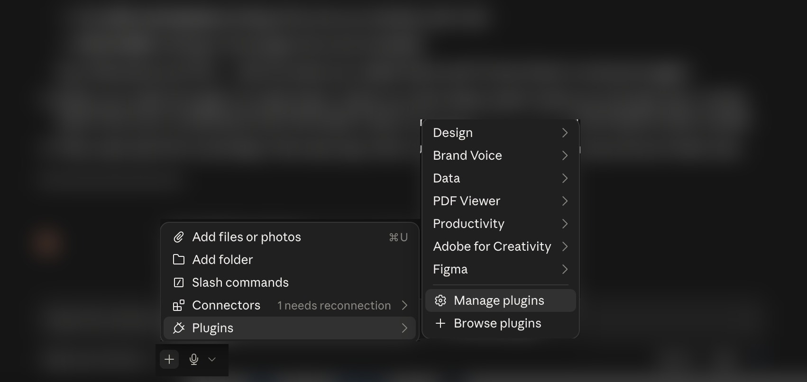
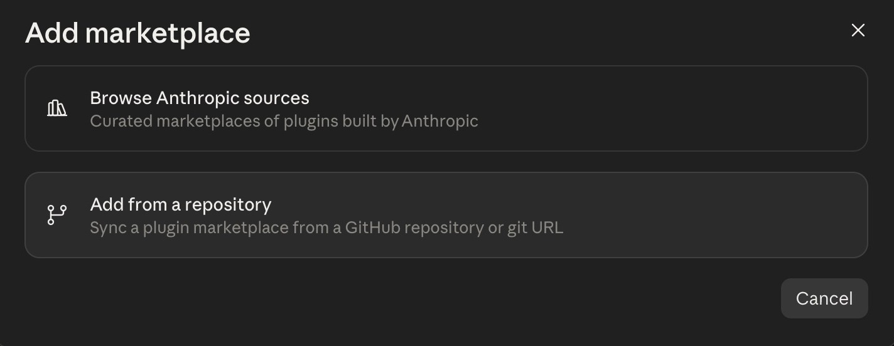
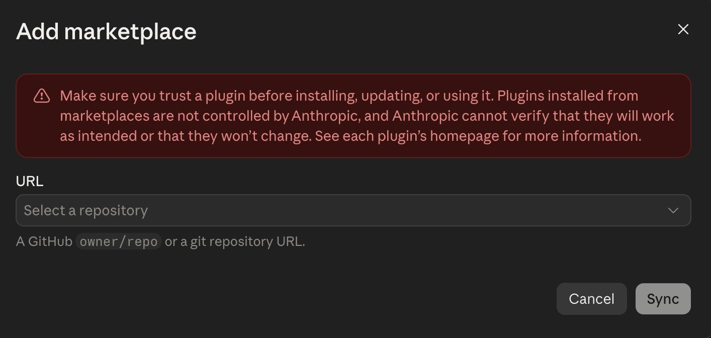

# OCHA BDU skills for Claude

Adds OCHA brand knowledge to Claude — colours, logo rules, chart and map standards,
house writing style, logo production, and the full video pipeline.

Once installed, you just ask Claude for the work and it follows OCHA standards
automatically. You don't have to explain them every time. **And they stay current** — we
improve them regularly, and your copy updates from our repository rather than needing a
reinstall.

> **These instructions are for the Claude Code desktop app** (Mac or Windows).
> **Not for Terminal.**

---

## ⚠️ Before you start — you need a paid Claude plan

**Claude Code is not available on the free plan.** You need **Claude Pro** (or higher —
Max, Team, Enterprise). Without it, the Claude Code tab won't be there and none of the
steps below will work.

---

**Setup takes about 5 minutes.** Follow the steps in order.

---

## Step 1 — Install Claude on your computer

Download it here: **https://claude.ai/download**

Install it like any other app, then open it and sign in.

> One app, **Mac or Windows**. Claude Code comes with it — there's nothing extra to
> download. If you already have the Claude app, skip to Step 2.

---

## Step 2 — Open Claude Code

In the Claude app, click the **Claude Code** icon in the left sidebar.

> **This matters.** The Claude app has several tabs — Claude, Claude Code and Cowork.
> **These skills only work on the Claude Code tab.**

### It asks you to choose a folder

A window opens asking you to pick a folder. **Pick `Desktop` and click Open.**

**This is not about the skills.** Claude Code can't open at all without a folder — it's
its own one-time setup. It just happens to appear now because this is your first time
using it.

- **Nothing is saved into that folder.** The skills install inside Claude itself.
- Picking `Desktop` here changes nothing and breaks nothing.

**Why Claude Code wants a folder at all:** it works *on files* — it makes charts, edits
videos, writes documents. The folder tells it **where to look for your files and where to
save what it makes.** That only starts to matter once you're doing real work, and you
pick the right folder then (see below).

### Say yes to the permission prompts

The first time you use Claude Code, it asks permission before doing things on your
computer — reading a file, running something. **Approve these when prompted**, or it
won't be able to do the work.

Tired of being asked every time? At the **bottom left** there's a **Bypass permissions**
option. It stops the prompts and lets Claude act without checking each time — faster, but
you lose that checkpoint, so only turn it on for work you trust. Approving prompts one by
one is the safer default.

---

## Step 3 — Add the OCHA skills

You do this **inside the Claude app**, by clicking. Nothing to type into Terminal, and
nothing to paste into the chat.



1. In the **Claude Code** tab, click the **+** button next to the message box
2. Choose **Plugins**
3. Choose **Manage plugins**
4. Click **Add** at the top right
5. Choose **Add marketplace**
6. Choose **Add from a repository**



7. Paste this into the **URL** box, exactly:

```
UN-OCHA/ocha_claude_skills_BDU
```

8. Click **Sync**



> ### You will see a red warning. This is normal — keep going.
>
> It says Anthropic can't verify plugins that don't come from them. It appears for
> **every** plugin that isn't Anthropic's own, including this one, and it is not a sign
> that anything is wrong.
>
> These skills are OCHA's. The address you just pasted is the **UN-OCHA** organisation on
> GitHub, it is maintained by the Brand and Design Unit, and nobody outside BDU can change
> what's in it. Questions: **ochavisual@un.org**.

**OCHA BDU** now appears in the plugin list. Install it, and you're done.

> **Why clicking and not a pasted message?** Earlier versions of these instructions asked
> you to paste a message that ran commands. Those commands come from a separate developer
> tool that the Claude app doesn't include, so on most laptops they simply failed. The
> buttons above are built into the app and work on every machine.

### Only if you installed these skills the old way

If you added the skills by hand before September 2026, you now have two copies of each and
Claude will see duplicates. Paste this into the chat box **after** the plugin is installed
and showing up:

> I have just installed the OCHA BDU plugin. Please confirm it is installed and that you
> can see its skills. **Only if it is**, delete these folders from my `~/.claude/skills/`,
> because they are old manual copies the plugin now replaces: ocha-visual-identity,
> ocha-dataviz, ocha-mapping, humanitarian-icons, ocha-editorial-style, ocha-design,
> ocha-video, ocha-logo-production. Do not touch any other folder there. If the plugin is
> **not** installed, stop and tell me — do not delete anything.

Brand new to these skills? Skip this — there's nothing to clean up.

---

## Step 4 — Quit Claude and open it again

**This step is required.** The plugin loads when Claude starts.

Quit Claude completely, then open it again and go back to the **Claude Code** tab.

---

## Step 5 — Check it worked

Type this in the Claude Code chat box, like a normal question:

> **what OCHA skills do I have now?**

Claude should list eight skills. If it does, you're finished. 🎉

---

## How updates work

We improve these skills regularly. Your copy comes from our repository, so an update is
never a reinstall — at most it's a refresh.

Claude Code checks for plugin updates on its own, and in most cases you'll simply have the
newest version the next time you launch the app. We are still confirming how reliably that
happens in the desktop app, so we won't promise you never have to think about it.

**If Claude seems to be working from something out of date**, open the same panel you
installed from — **+** → **Plugins** → **Manage plugins** — and update **OCHA BDU** there.
Then quit Claude and open it again.

If you're ever unsure, ask us: **ochavisual@un.org**. We'll tell you whether there's
anything new worth refreshing for.

---

## How to use it

Nothing to remember. Just ask for what you need:

> *"Make a bar chart of funding by sector, OCHA style"*
> *"What are the OCHA brand colours?"*
> *"How much clear space does the OCHA logo need?"*
> *"Check this paragraph against our house style"*
> *"Add subtitles and the OCHA ending to this video"*

Claude picks the right skill by itself.

---

## 🎬 If you make videos

**On a Mac, there is nothing for you to do here.** Video work runs on a separate program
called **OCHA QuickVid**, and the first time you ask Claude for a video it installs it for
you. It will tell you it's doing it. Expect about **10 minutes** that first time — no
password, nothing to download yourself. After that it's instant and never happens again.

Everything runs on your own computer. Your footage is never uploaded anywhere.

### On Windows

Windows needs one manual step. **Open this page in Chrome** — Safari and Edge don't play
nicely with it:

**https://un-ocha.github.io/quickvid_BDU/**

Download the installer it offers and double-click it.

> Windows shows *"Windows protected your PC"* → **More info** → **Run anyway**. Normal for
> any internet download.

### If video stops working

An old copy of QuickVid won't update itself properly, and restarting your computer won't
fix it. On a Mac, just tell Claude *"QuickVid isn't working, please repair it"* — it
re-runs the installer, which repairs it in place and keeps your setup.

On Windows, delete the **OCHA QuickVid** app, go back to the page above, scroll to the
bottom → **Help & reinstall**, and install it again.

---

## What you get

| Skill | What it helps with |
|---|---|
| `ocha-visual-identity` | Brand colours, fonts, logo rules, clear space, the OCHA design system |
| `ocha-dataviz` | Which chart to use, and how OCHA charts should look |
| `ocha-mapping` | OCHA map standards — boundaries, symbols, disclaimers |
| `humanitarian-icons` | The 389 OCHA Humanitarian Icons |
| `ocha-editorial-style` | OCHA house style — numbers, dates, currency, capitalisation, acronyms |
| `ocha-design` | Loads visual identity + charts + maps together |
| `ocha-logo-production` | Building logo packages from Illustrator — languages, variants, verified exports |
| `ocha-video` | Everything video — cutting, subtitles, lower third, logo ending, packaging |

---

## 🧠 What model should I use?

**Start with Sonnet.** Opus and Fable are more powerful but eat through your usage limits
much faster — and for most of this work they won't give you a better result.

Switch up only for the jobs that need real judgment:

| What you're doing | Model |
|---|---|
| Branding a finished clip — subtitles, lower third, logo ending | **Sonnet** |
| Charts, maps, icons, brand questions, packaging files | **Sonnet** |
| Choosing which 60 seconds to cut from a long briefing | **Opus** |
| Translating subtitles | **Opus** |
| Something broke and you need it debugged | **Opus** |

You can switch models in the middle of a session — the work carries over.

> **The one that matters:** if you're cutting a principal's words, use **Opus**. A weaker
> model's mistake there isn't a broken file — it's a clip that misrepresents what someone
> said.

---

## If something doesn't work

**"I installed them but Claude doesn't know about them."**
You need to quit Claude and reopen it (Step 4). The plugin loads at startup.

**"Claude lists seven skills, not eight."**
Your copy predates the plugin. Do Step 3 once — the buttons in the app — and then the
clean-up message underneath it.

**"QuickVid keeps asking me to restart and never works."**
You have an old version, and restarting won't fix it. On a Mac, tell Claude *"QuickVid
isn't working, please repair it"*. On Windows, delete the app and reinstall from **Help &
reinstall** at the bottom of the QuickVid page.

**"Claude says it can't find the QuickVid engine."**
On a Mac it should offer to install it — just ask for the video again. On Windows, do the
install from the QuickVid page (see the video section above).

**"Claude can't open a Dropbox file."**
Some skills point at shared files in the OCHA DMU Dropbox. You need access to that team
folder. Ask us and we'll sort it out.

**Anything else:** **ochavisual@un.org** — we'd rather help than have you stuck.

---

## Project Owner

Javier Cueto, Head of Brand and Design Unit

## Maintained by

**OCHA Brand and Design Unit (BDU)**
- Team: ochavisual@un.org
- Focal point: Javier Cueto (cuetoj@un.org)
